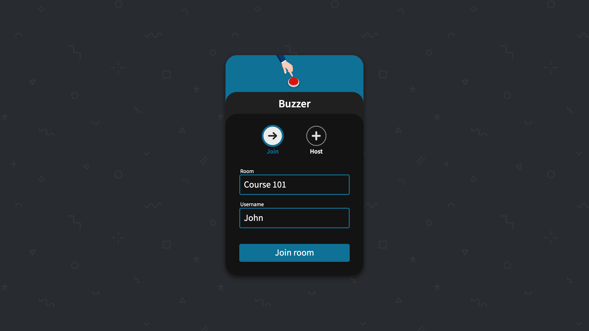
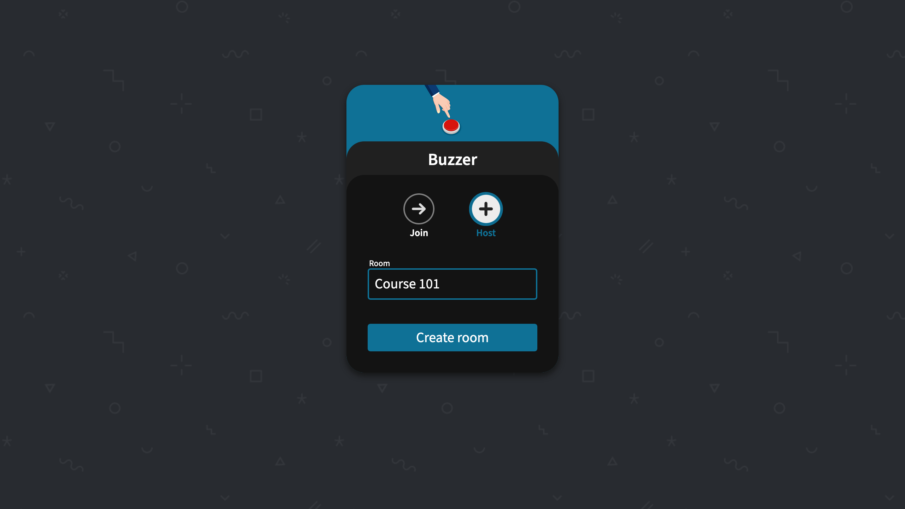
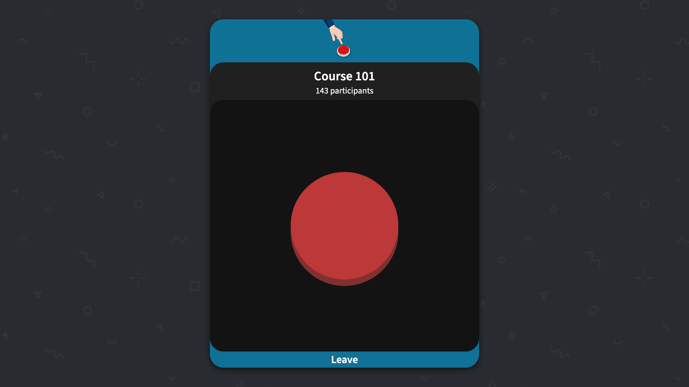
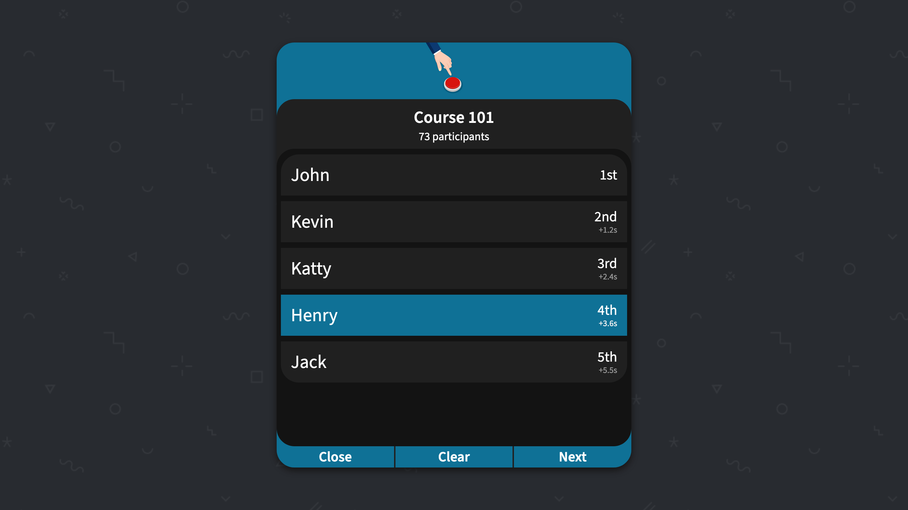

[](https://github.com/scotow/buzzer/tags)
[](https://github.com/scotow/buzzer/actions)


## Features

- Custom room name
- Buzz list
- Buzz selection

## Options

```
Usage: buzzer [OPTIONS]

Options:
  -v, --verbose...         Increase logs verbosity (Error (default), Warn, Info, Debug, Trace)
  -a, --address <ADDRESS>  HTTP listening address [default: 127.0.0.1]
  -p, --port <PORT>        HTTP listening port [default: 8080]
  -h, --help               Print help
  -V, --version            Print version
```

## Docker

```
docker run ghcr.io/scotow/buzzer/buzzer:latest
```

## Screenshots

### Join



### Create



### Buzz



### Host

